Some examples of small programs developed with the powerful COBOL language

## Basic Examples - COBOL ANSI

These codes can be tested in [Jdoodle](https://www.jdoodle.com/execute-cobol-online/), an Online COBOL compiler.

| File                                                 | Description                                              | Result                                      | 
| ---------------------------------------------------- | ---------------------------------------------------------| ------------------------------------------- |
| [HelloWorld](./HelloWorld.cbl)                       | Famous example "Hello World"                             | 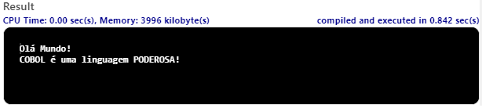 |
| [Calculations](./Calculos.cbl)                       | Basic Arithmetic Calculations                            | 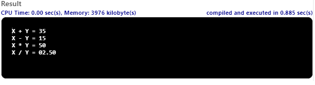   |
| [Strings](./Strings.cbl)                             | String Manipulation (Replacement - Replace)              | 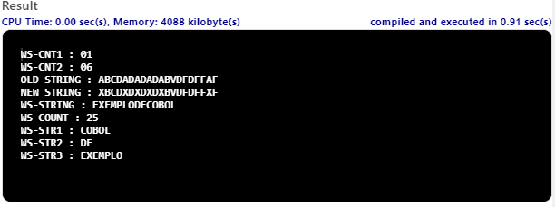          |
| [Condicionais](./Condicionais.cbl)                   | Conditional Examples and Custom Validation)              | 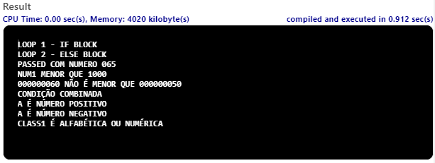|
| [Function/Loop](./Funcoes_e_Loop.cbl)                | Calling Functions and Loop                               | 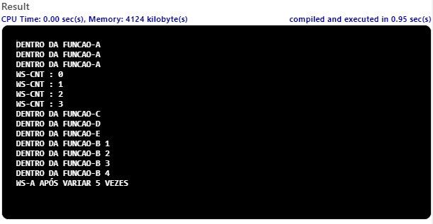   |
| [Nested Loop](./Loop_Aninhado.cbl)                   | Nested Loop                                              | 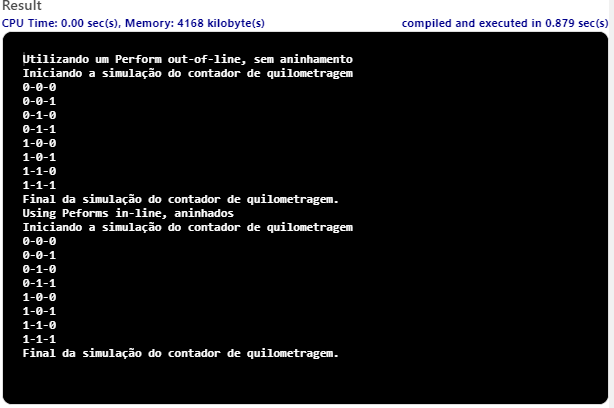           |
| [Accept e Display](./Accept_Display.cbl)             | Data entry and processing                                | 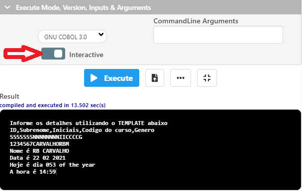   |
| [Crypto](./Crypto.cbl)                               | Encrypt and Decrypt a Word                               |      |
| [JobCalc](./JOBCALC.COB)                             | Mathematic Expression Solving                            | 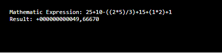     |

## Examples with screens and their components - COBOL Micro Focus eXtend

The codes shown below require a local compiler (I'm using Micro Focus eXtend 9.2.5) for Microsoft Windows.

# Bars, Colors and Sizes

The code [Barras](./Barras.cbl) presents several lines in different formats and sizes that can be used in the most varied types of applications using COBOL Micro Focus eXtend in a Windows environment. Code taken from the Micro Focus eXtend documentation itself and was translated and adapted for this repository.

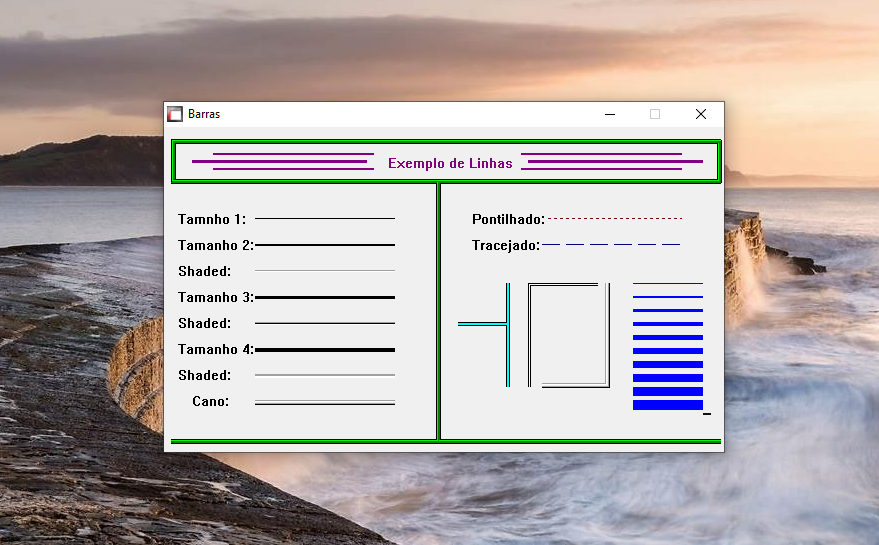

# Web Browser

The Code [Browser](./Browser.cbl) demonstrates that it is possible to develop your own web browser using the Micro Focus eXtend tools. Code taken from the Micro Focus eXtend documentation itself and was translated and adapted for this repository.

# Checkbox Component

The code [Checkbox](./checkbox.cbl) demonstrates a simple use of the CheckBox component where the simulation of the final price of a vehicle changes according to the selected options. Code taken from the Micro Focus eXtend documentation itself and was translated and adapted for this repository.

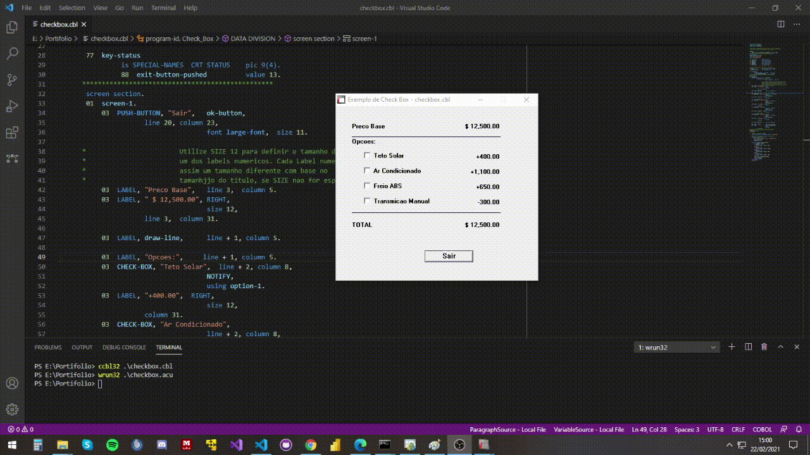

# Radio Button Component 

The code [Radiobtn](./radiobtn.cbl) demonstrates a simple use of the Radio Button component where the simulations where would you be simulating the selection of an ice cream flavor. Code taken from the Micro Focus eXtend documentation itself and was translated and adapted for this repository.

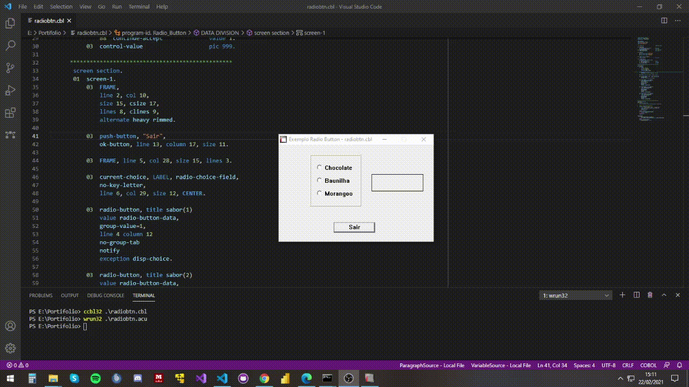

# Grid Component

The code [Gridctl](./gridctl.cbl) demonstrates an interesting use of the Grid Control component where we can manipulate the grid, changing the column size, the row size, Selecting an entire column, selecting an entire row, changing the value inside the Cell, an animated Bitmap, Pop Up menu by clicking right-click and click directly on the Grid's animated icon. This component is widely used in the most varied types of applications and the component's potential goes far beyond what this example presents. Code taken from the Micro Focus eXtend documentation itself and was translated and adapted for this repository.

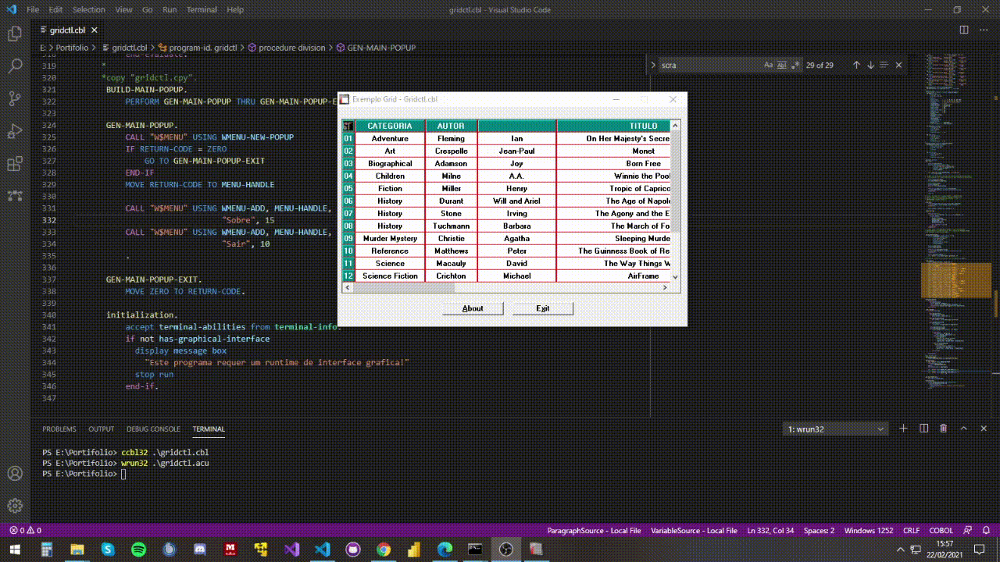
