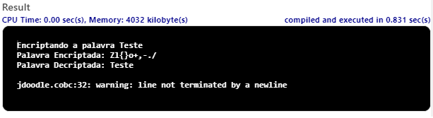

Muitos profissionais de TI e grandes CIO's pelo mundo dizerem que o COBOL é uma linguagem ultrapassada, inviável e até mesmo morta, mas talvez apenas desconheçam e acabam desprezando o seu verdadeiro potencial, não vou negar que lá em 2001, quando iniciei minha graduação em Engenharia da Computação e estudei sobre a história das linguagens, também cheguei a ter o mesmo pensamento, não apenas sobre o COBOL mas entre outras tantas linguagens tidas como "extintas" e até pensei que nem existiam mais programas em tal linguagem sendo utilizados.

Em 2004 comecei a trabalhar em uma Indústria de Móveis e para a minha surpresa eles utilizavam a linguagem COBOL, então eu percebi o quanto eu estava engando sobre o COBOL.
Minha idéia é mostrar um pouco do que sei sobre a linguagem, apresentar o código e o resultado com imagens.

## Projeto 1 - Criptografia

| File                                                            | Descrição                                                | Resultado                               |
| --------------------------------------------------------------- | ---------------------------------------------------------| --------------------------------------- |
| [Crypto.cbl](./Crypto.cbl)                                      | Encriptar e Decriptar uma palavra                        |  |
